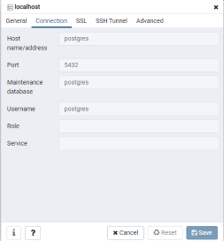
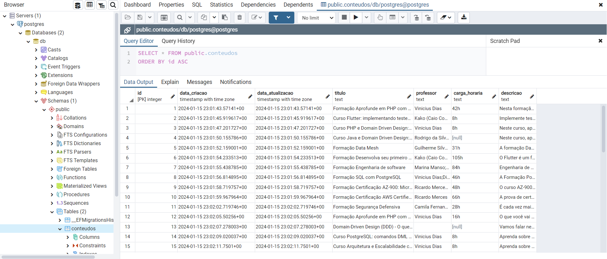
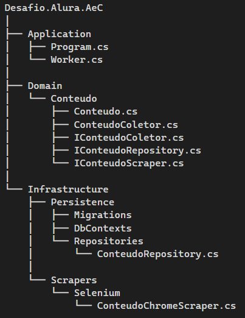

# Desafio Alura AeC

Este projeto tem por objetivo acessar o site do Alura e realizar a coleta de informações sobre o conteúdo, tais como, professor, curso, duração do curso e descrição.

## Tecnologias utilizadas

* Projeto em Worker Service com .Net 7.0
* PostgreSQL 13
* Selenium WebDriver
* EF Core

## Como executar

Configurar o termo que deseja pesquisar no arquivo [appsettings.json](appsettings.json)

```json
{
  "ConnectionStrings": {
    "DbConnection": "Host=localhost; Port=15432; Database=db; Username=postgres; Password=root"
  },
  "UrlSite": "https://www.alura.com.br",
  "Termo": "DDD",
  "Logging": {
    "LogLevel": {
      "Default": "Information",
      "Microsoft.Hosting.Lifetime": "Information"
    }
  }
```

Na pasta raiz do projeto, subir o docker-compose com o banco de dados Postgres 13:
```
docker-compose up -d
```

> O docker-compose está configurado para não utilizar volumes locais, então os dados são perdidos sempre que parar os containers.

E rodar o projeto:

```
dotnet run --project Desafio.Alura.AeC.csproj
```

> O projeto roda as migrations automaticamente.

## Acessar os dados

Para visualizar as tabelas e dados criadas, acessar: [PgAdmin](http://localhost:16543/browser/)

```
Usuário: cris.pessin@gmail.com
Senha: admin
```

Conectar ao server com:

```
Hostname = postgres
Porta = 5432
Username = postgres
Password = root
```



Os dados devem ser carregados conforme imagem:



## Como o projeto funciona?

O projeto segue uma estrutura de desenvolvimento utilizando Domain-Driven Design (DDD).



- Application: Contém a lógica de inicialização e execução da aplicação.
- Domain: Contém as classes de domínio e interfaces de repositório e scraper que precisam ser implementas pelo camada de infraestrutura.
- Infrastructure: Contém a implementação específica de acordo com as tecnologias utilizadas no projeto para persistência de dados e executar o robo.
- Scrapers/Selenium/ConteudoChromeScraper.cs: Contém implementação utilizando Seleniun do robô que consulta e coleta os dados no site da Alura.


## Migrations

### Gerar novas Migrations

Para gerar novas migrations utilizando o Console do Gerenciador de Pacotes execute:

```
Add-Migration "init" -o Infrastructure\Persistence\Migrations
```

### Como executar as Migrations manualmente

Executar as migrations com o comando: Update-Database